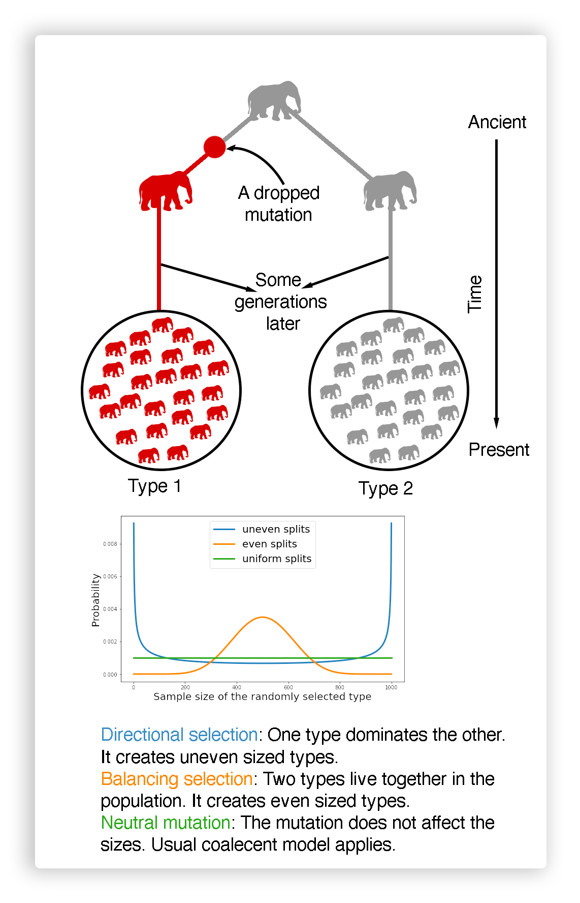
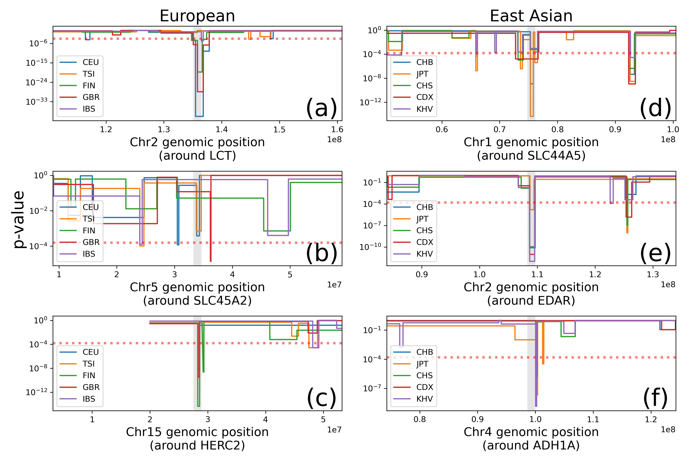
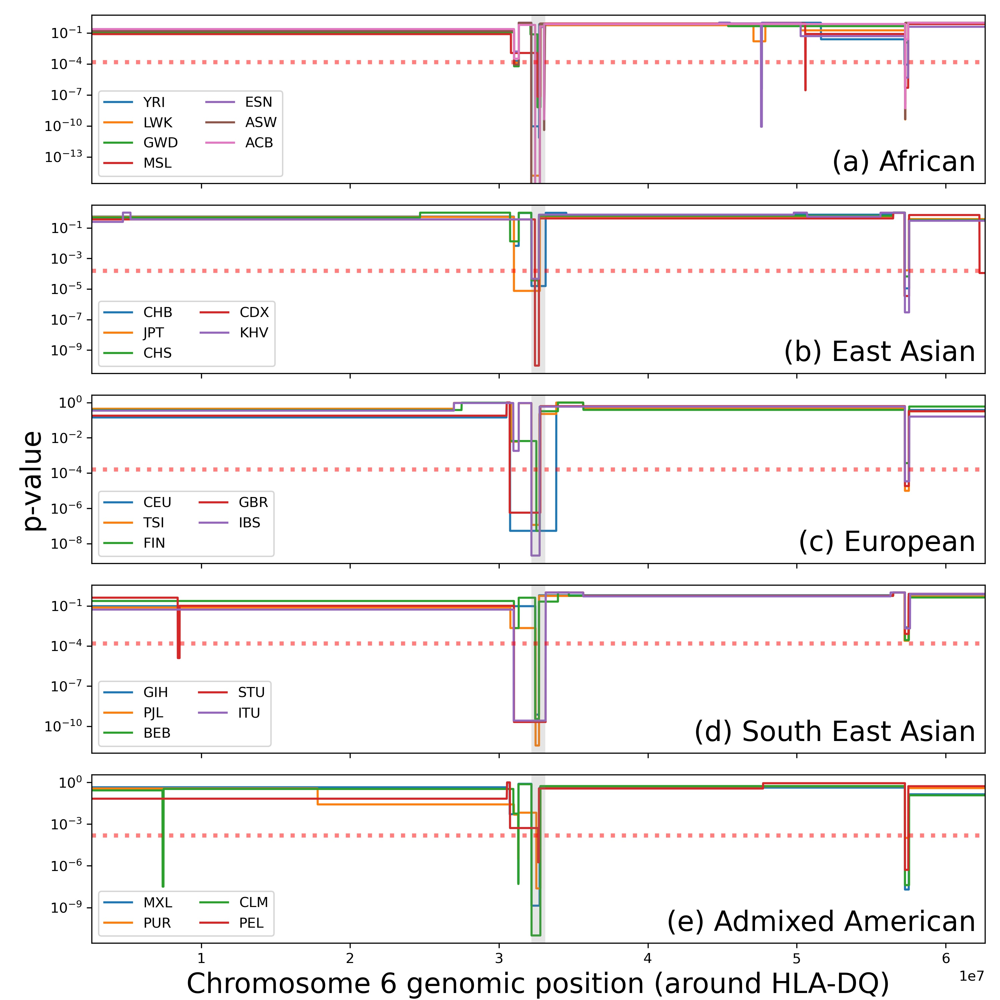
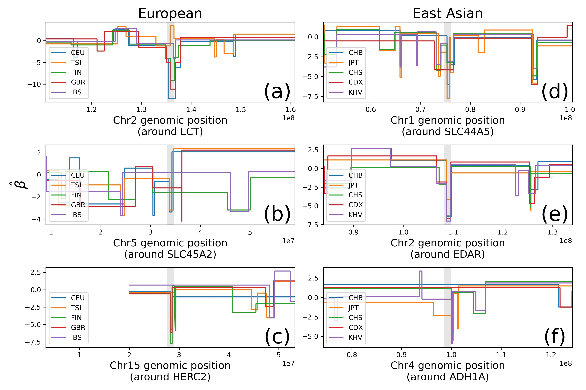
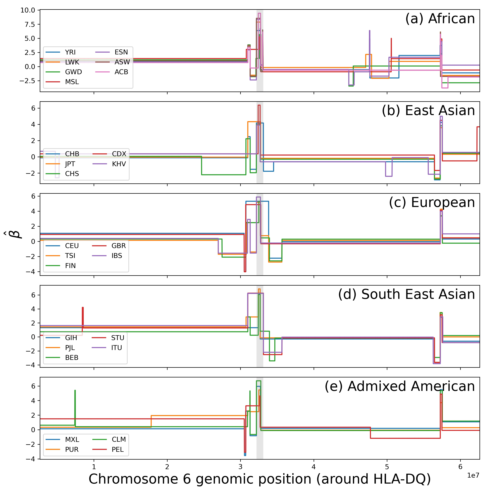
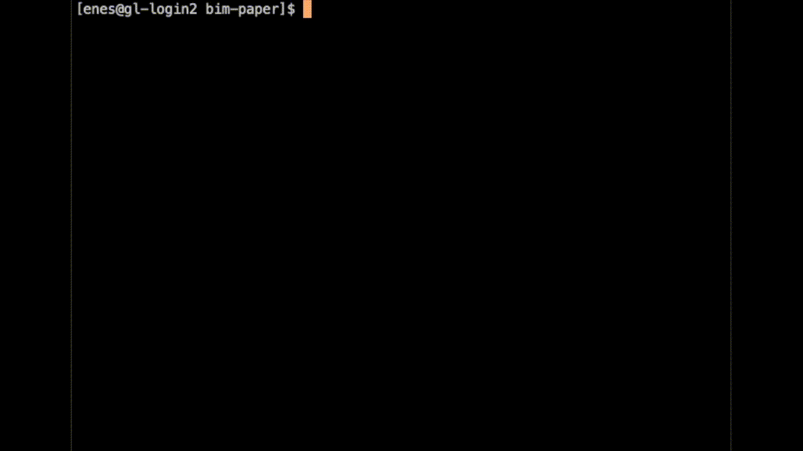

Results for &beta;-Imbalance (BIM): Robust detection of natural selection using a probabilistic model of tree imbalance
====================================================
* Here is [the paper](https://doi.org/10.1093/genetics/iyac009) of this work.
* If you want to use the software of this paper refer [here](https://github.com/jthlab/bim). 
* Cite this paper [here](citation.bib).

Introduction
-------------------------
We developed a fast likelihood-based method to infer natural selection from whole-genome sequences. Unlike the classical neutrality tests, we can model the evolutionary process by considering other factors such as population size histories. Our main contribution is we model the distribution of split sizes in a genealogical tree to measure *how imbalance a tree is?* A homozygote beneficial mutation causes unbalanced splits in a tree, conversely a heterozygote beneficial mutation causes balanced splits. We model the distribution of these splits by linking it to the effect size and the type of the mutation. Below, there is a rough sketch of this idea. Suppose each elephant symbol represents a gene in each elephant's chromosome (a gene genealogy). Just after the top split, a mutation arises at the left elephant (red). After many generations, both types (gray and red) survive to the present. Our aim is, by looking at today's elephant population modeling the tree topologies. Since we don't see the actual gene genealogies, we do not know where the mutations are located. So we search through possible tree topologies that could have risen the current sample. Naively, if the sizes of these types are quite different we might guess that this location is experiencing a directional selection because environmental factors favor one type and the sample reproduce from that type's lineage. If the sizes of these types are quite close to each other we might guess that location might experience a balancing selection. 
<br><br>


Examples
--------
These examples demonstrate simple usages of our method.
* [Demo](Examples/Demo.ipynb) 
* [Real Data: 1000 Genomes Project LCT example](Examples/1000_genome_LCT_3pop_demo.ipynb) 
* [Time Complexity under neutral mutation](Examples/Time_complexity.ipynb)

Slim Simulations
----------------
[Slim](https://messerlab.org/slim/) allows us to simulate sequences under selection. We considered these 4 settings:
* [Constant effective population size and a single beneficial dominant mutation.](Simulations/Simulation---Constant_Directional_Selection.ipynb)
* [Constant effective population size with a couple of mutation with heterozygote advantage.](Simulations/Simulation---Constant_Balancing_Selection.ipynb)
* [Exponentially growing effective population size and a single beneficial dominant mutation.](Simulations/Simulation---Exponential_Growth_Directional_Selection.ipynb)
* [Exponentially growing effective population size and a couple of mutation with heterozygote advantage.](Simulations/Simulation---Exponential_Growth_Balancing_Selection.ipynb)

You can also check [plots](Simulations/plots) folder to see our results.

1000 Genomes Project
--------------------

### How to replicate the results?
We applied our model to [1000 genome project](https://www.internationalgenome.org/) specifically to the [tree sequences data](https://zenodo.org/record/3051855#.YGSwl2RKg-Q). 
All results in this project can be reproduced by [Analysis notebook](1000GenomesProject/Analysis.ipynb) and [median centered Analysis notebook](1000GenomesProject/AnalysisCmedi.ipynb)
It generates ~30G of the result data and it took ~3 hours to complete everything on a HPC. The replication doesn't need HPC but it would take too much time otherwise. I use [this module](https://github.com/enesdilber/pyslurm) to send jobs to the cluster. But all `srun.run(<terminal job>)` can be 
replaced by `! <terminal job>`.  In this repository we only published a small amount of those results. Here is a skecth of our data analysis pipeline:
1. First we estimated population size histories of 26 populations by using a piecewise constant population size
[model](https://github.com/enesdilber/bim/blob/9cd8fd027d4d242e77856b7c102eec945ec68381/utils.py#L427). You can access the notebook 
[here](Population_Size_Estimates.ipynb).
1. Then we calculated the statistics and estimated our splitting parameters using this [module](https://github.com/enesdilber/bim). We used 10kb window sizes
with 5kb stride. 
1. For median centered versions (this is useful to detect populaiton spesific selection), we caclulated avarage statistics for each window to understand which populations diverge from others. We use this to eliminate shared signals among
human populations. Later we call this variables `<stat>Cmedi` or `<stat>Cmean`.
1. For a statistic calculated on a chromosome and a population, we apply a 
[change point detection](https://centre-borelli.github.io/ruptures-docs/code-reference/detection/pelt-reference/) to isolate the spikes. 
This reduces the noise and helps us to understand the length of the region that experience the selection.  
1. We will estimate the average statistic each of these segments estimated by change point detection. But variance of the average statistic also has
a autocovariance part because of the linkage disequilibrium. To account this phenomena, we calculate the autocovariance function for each statistic
population pair. 
1. Then we took the genome-scan p-values for each segment for a population. Segments are coded as `p<pop_id>c<chrno>.<segment_order>`. 
They be accessed from [here](1000GenomesProject/gene_scores). Along with 
[the p-values plots](1000GenomesProject/plots). The p-values represent `<tail of the distribution>_<pop_id>_<stat>.jpg`
1. To compare our beta-splitting paremeters with other selection paper results, we also calculated rank p-values. 

### Highligted Results
p-values of the genome scan segments around the specified gene:
<br><br>
<br><br>
Z scores of the same segments:
<br><br>
<br><br>

### How to browse the results?
1. See [Segmented genome scans notebook](1000GenomesProject/Segmented_genome_scans.ipynb) to plot the genome-scan p-values for our method. You can either 
specify the gene or the position on genome. 
1. We also provided a [command line program](1000GenomesProject/browser.py) to browse the results. In order to use it, locate your terminal to [1000GenomesProject](1000GenomesProject) folder, then call python.
```bash
cd 1000GenomesProject
python browser.py
```
Here is a demo:

If you want to search significant segments, go to [the p-values plots](1000GenomesProject/plots). Locate the statistic and significant tail along with the population, and then enter the segment to the [browser](1000GenomesProject/browser.py). Significant lower tails imply directional selection and upper tails imply balancing selection for our beta-splitting paramenters. 
